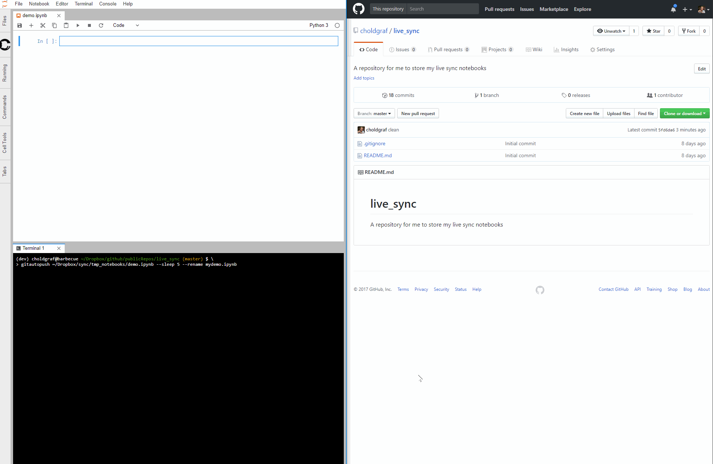
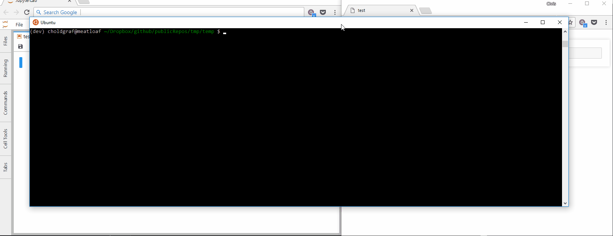

# gitautopush
Quickly copy in changes to a file and push code to a git repository used
for teaching.

Gitautopush is meant to be used as a live synchronization tool for teaching.
Say you've got a Jupyter notebook that you are populating with code while
you are teaching a class. Oftentimes students want to see previously-written
code as a "reference" or as way to reorient themselves. This tool lets you
automatically synchronize your notebook to a GitHub repo so that students can
quickly see the latest changes. See the GIF below for an example.

## Installation

You can install with pip:

`pip install gitautopush`

## Usage

Navigate to the folder that contains the Git repository to which you'll be
pushing your changes. Now determine the path to a target notebook.
This is the notebook that you'll be populating during teaching. Run the
following command to start `gitautopush`:

`gitautopush /path/to/target/notebook.ipynb`

The following will happen:

1. If the target notebook is not in the current folder, it will be copied to
   the current folder.
2. `gitautopush` will look for changes to the target notebook. If it detects
   changes, it will copy them into the current folder and commit them.
3. `gitautopush` will then push the state of the git repository to the default
   remote repository.
4. This cycle repeats.

## Converting with `nbconvert`

In addition, you can tell `gitautopush` to run `nbconvert` on your file
before moving it to a new location. This is useful if you want to convert
a notebook to HTML and share it with students using a public link (e.g., with Dropbox).
To do so, use the `--nbconvert-to` parameter, as seen below:

## Parameters

Below are parameters you can use to customize the behavior of Gitautopush.

* `--sleep <INT>` - the amount of time (in seconds) to wait in between
  attempts to synchronize.
* `--rename <STRING>` - a new name for the file/folder you are synchronizing.

## Acknowledgements

This tools was first thought up by John Lee, then adapted as a Python module
by Chris Holdgraf.
